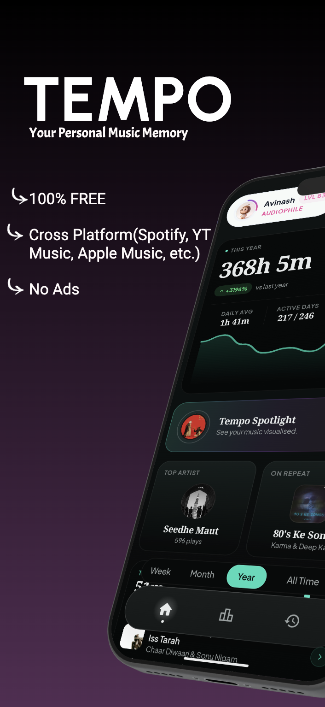
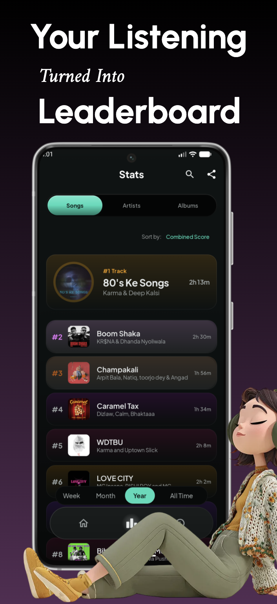
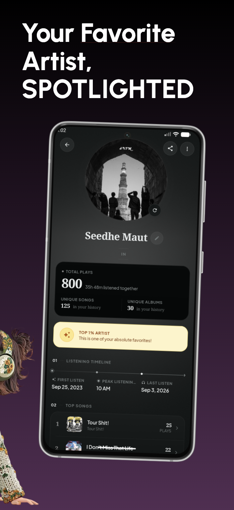
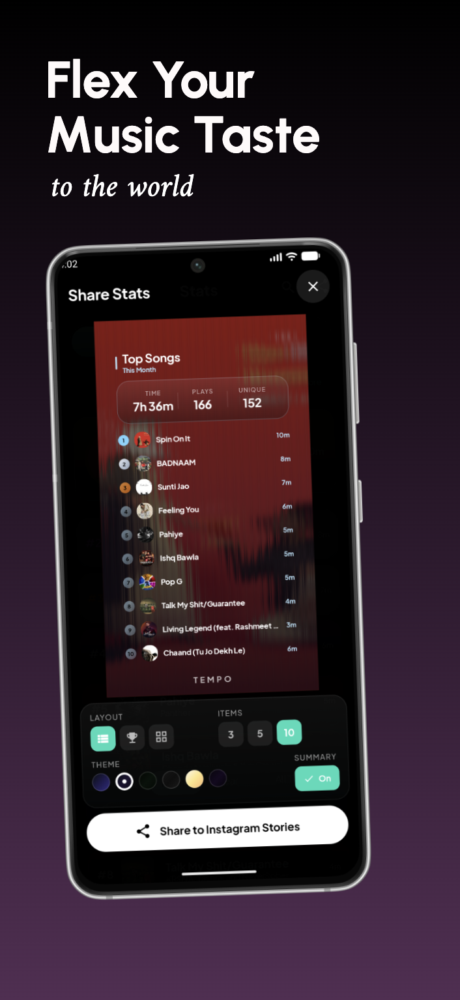
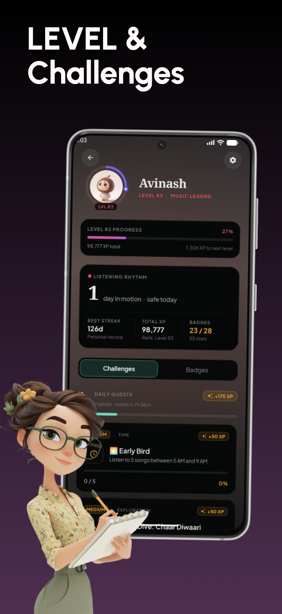
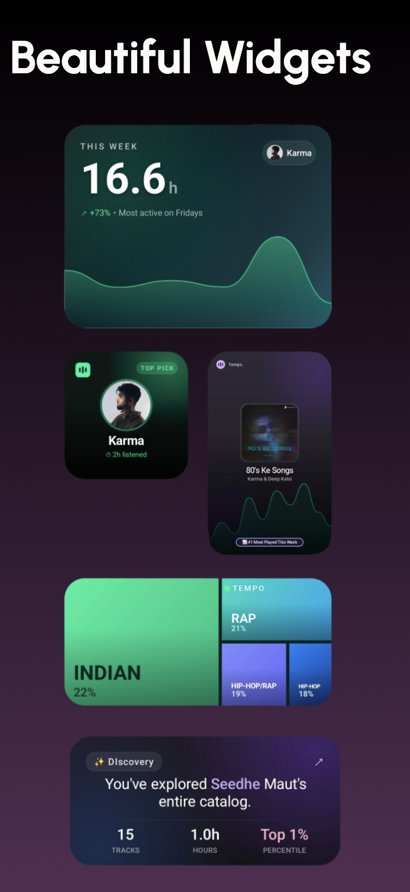

# Tempo

<p align="center">
  
</p>

<p align="center">
  <a href="https://play.google.com/store/apps/details?id=me.avinas.tempo.release">
    
  </a>
</p>

<div align="center">

[](https://kotlinlang.org) 
[](https://developer.android.com) 
[](Changelog.md)
[](LICENSE) 
[]()

</div>

Tempo is a local-first music journal and scrobbler for Android. It follows playback across Spotify, YouTube Music, and your other players and keeps the full history on your phone. You get timeline trends, heatmaps, and exportable stat cards for tracks, artists, and albums — built on device, ready to share.

---

## Screenshots

<p align="center">
  
  
  
  
</p>
<p align="center">
  
  
  
  
</p>

---

## Features

### Playback tracking
- Captures playback via Android `NotificationListenerService` from Spotify, YouTube Music, Apple Music, Poweramp, Tidal, SoundCloud, and players exposing standard media sessions.
- Filters non-music media events like podcasts, audiobooks, and system alerts.
- Pauses tracking when media volume is muted, with an optional battery-saver cutoff below 20% battery.
- Caps repeated loops of short tracks at three times track duration to avoid inflated counts.
- Survives OEM background process kills via synchronous service shutdown flushes and periodic WorkManager reconciliation.

### Analytics and history
- Aggregates play counts, total listening time, heatmaps, and timeline trends for tracks, artists, and albums.
- Calculates a Listening Quality Score (LQS) weighted by completion rates, repeat loops, and skip counts.
- Visualizes acoustic properties (energy, valence, danceability) from track metadata to map mood distribution.
- Home screen listening overview sheet displays hourly play volume, period comparisons, and one-tap card export.
- History view includes persistent text search, source filtering, and custom date range pickers.
- In-place search drawer on the rankings screen filters songs, artists, and albums with global position badges.

### Spotlight cards and export
- Renders export cards on Compose Canvas:
  - 24-hour radial activity distribution (Circadian Rhythm).
  - Weekday versus weekend comparison (Weekly Pulse).
  - Inactive tracks with days elapsed since last playback (Forgotten Favorite).
  - Monthly listening summaries.
- Six visual export themes (Midnight, Glass, ASCII, Minimum, Daylight, Glitch), including scanlines, chromatic aberration, and artwork blur in Glitch mode.

### Library management
- Merge duplicate or split albums, preserving track history and scrobble archives under a single target album.
- Split misassigned tracks from artist profiles into new or existing artist entries.
- Propagate artist renames across track credits, multi-artist strings, and cached aggregates in a single database transaction.
- Normalizes artist names with Unicode NFKC and script-aware diacritic folding, so Japanese, Korean, Cyrillic, Indic, and Thai names don't split into duplicate records.

### Data imports
- Imports full Last.fm scrobble history. Recent plays stay in the fast query set, older plays move to an indexed archive.
- Ingests Google Takeout multi-part ZIP exports and localized YouTube Music `watch-history.json` files.
- Fetches track audio attributes from Spotify Web API, with an optional API polling mode to reduce battery draw when notification listening is turned off.
- Resolves album cover art, release details, and genre tags from MusicBrainz.

### Browser companion extension
- Manifest V3 companion for Chrome and Firefox logging web playback from YouTube Music, Spotify Web, SoundCloud, Bandcamp, Apple Music Web, Deezer, and Tidal Web.
- Measures listen time directly from HTML media element playback positions rather than wall-clock timers.
- Queues plays locally in IndexedDB during network disconnections.
- Syncs to the phone over local Wi-Fi via `POST /api/plays`, authenticated with HMAC-SHA256 signatures.

### Privacy and backup
- Audit what the app can send at **Settings → Your Data → What we collect**. Each event lists the exact fields attached.
- Tap **diagnostics report** to share versions, library counts, detection health, and background-work status with a bug report. The app sends nothing automatically.
- Stores listening events, metadata, and computed statistics locally in Room SQLite databases.
- Secures authentication keys and API credentials in Android `EncryptedSharedPreferences`.
- Supports automated local database exports as well as Google Drive backups via Android Credential Manager.
- Reports only anonymous crash, error, and feature-use counts. No account, no identifiers, never your listening history. On by default, off in one tap at **Settings → Your Data**. Source builds report nothing. See [docs/ANALYTICS.md](docs/ANALYTICS.md).

---

## Building from source

### Prerequisites
- Android Studio Ladybug (2024.2.1) or newer
- JDK 17
- Android SDK 36

### Build the Android app

1. Clone the repository:
   ```bash
   git clone https://github.com/avinaxhroy/Tempo.git
   cd Tempo
   ```

2. (Optional) Supply API keys in `local.properties` at the project root:
   ```properties
   SPOTIFY_CLIENT_ID=your_spotify_client_id
   LASTFM_API_KEY=your_lastfm_api_key
   GOOGLE_WEB_CLIENT_ID=your_google_client_id
   ```

   Analytics is deliberately absent from that list: leaving `APTABASE_APP_KEY` unset means the app reports nothing at all, which is the intended state for a build from source. See [docs/ANALYTICS.md](docs/ANALYTICS.md).

3. Build the debug APK:
   ```bash
   ./gradlew assembleDebug
   ```

4. Run unit tests:
   ```bash
   ./gradlew test
   ```

### Build the browser extension

1. Enter the extension directory and install dependencies:
   ```bash
   cd browser-extension
   npm install
   ```

2. Compile extension bundles for Chrome and Firefox:
   ```bash
   npm run build
   ```

3. Load the unpacked build from `browser-extension/dist` via `chrome://extensions` or Firefox's `about:debugging`.

---

## Tech stack

| Layer | Technologies |
| :--- | :--- |
| **Language** | Kotlin 2.2.10 |
| **UI** | Jetpack Compose (Material 3, Compose BOM 2025.12.01) |
| **Architecture** | MVVM, Clean Architecture, Hilt DI |
| **Persistence** | Room SQLite 2.8.4, DataStore, EncryptedSharedPreferences |
| **Background jobs** | WorkManager 2.11.0, Foreground Services |
| **Networking** | Retrofit 3.0.0, OkHttp 4.12.0, Moshi |
| **Visualizations & Widgets** | Jetpack Glance 1.1.1, Vico 2.0.0, MPAndroidChart 3.1.0 |
| **Image loading** | Coil 3.3.0 |
| **Sync server** | Embedded NanoHTTPD, ZXing QR pairing, CameraX |
| **Browser extension** | TypeScript 5.4, Manifest V3 (Chrome & Firefox), esbuild |
| **Target platforms** | Android 8.0+ (Min SDK 26, Target SDK 36, Compile SDK 36) |

---

## Contributing

To contribute bug fixes, translations, or docs improvements:

1. Open an issue before submitting large architectural changes or new feature proposals.
2. Follow existing code architecture and confirm `./gradlew test` passes.
3. Submit a pull request with a concise summary of the change, reproduction steps for fixes, and screenshots for visual updates.

Review [CONTRIBUTION.md](CONTRIBUTION.md) for contribution guidelines and coding standards.

---

## License

Tempo is licensed under a modified AGPLv3. You may inspect the source code, compile and run the app for personal use, audit security, and contribute improvements back to the upstream repository. Commercial distribution, monetization, closed-source distribution, and rebranding are prohibited.

See [LICENSE](LICENSE) for the full license text.
